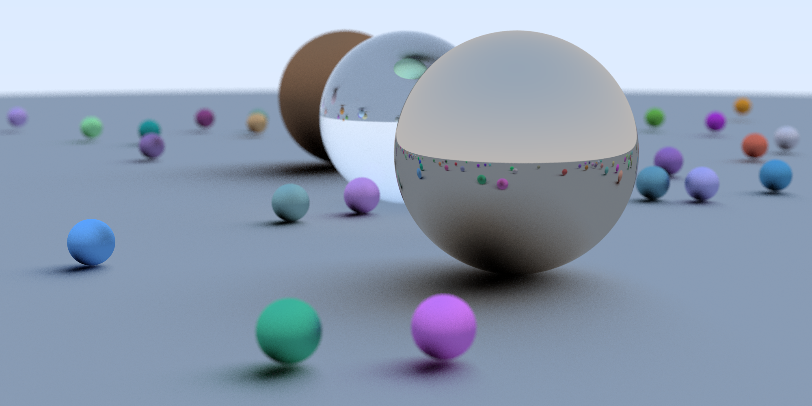

# rust_raytracer
I wrote this for two reasons:
* I think graphics programming is neat, and I'm always trying to learn more about the topic.
* I needed some more rust practice.

# Running

```bash
git clone https://github.com/by77er/rust_raytracer
cd rust_raytracer
cargo run --release
```